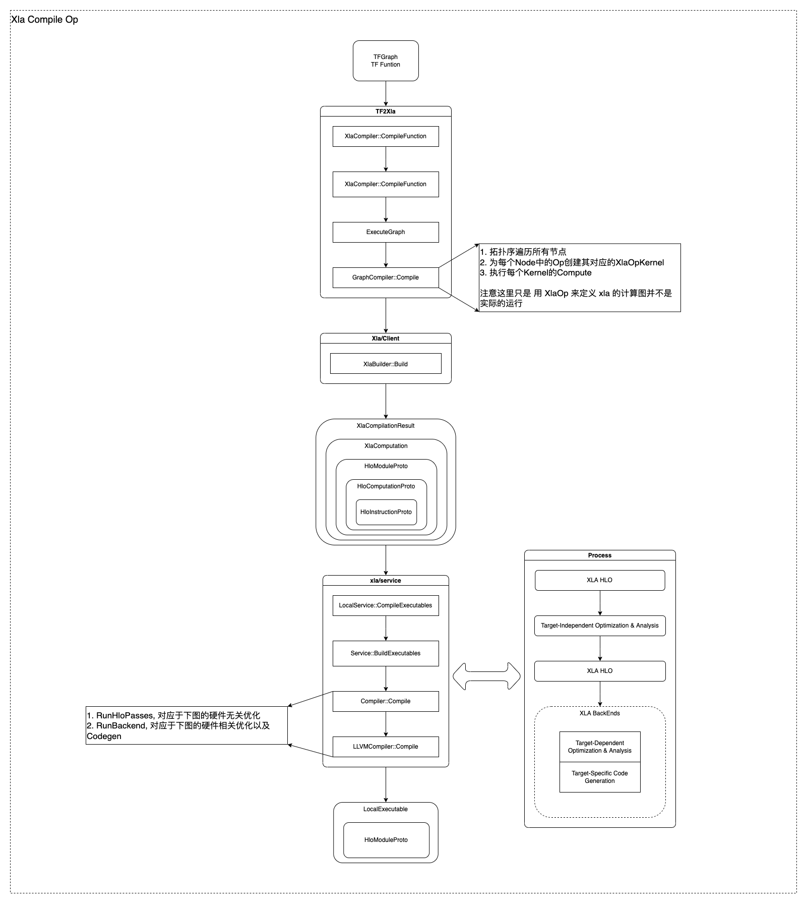
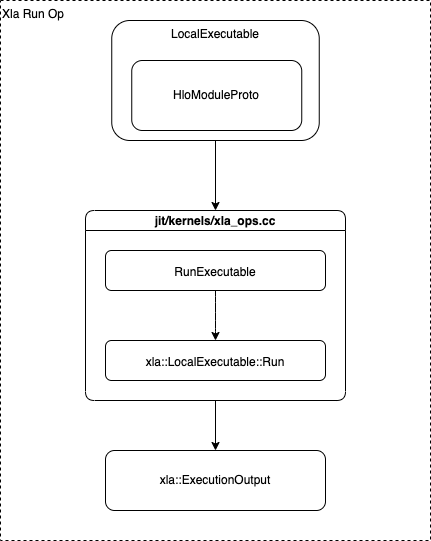
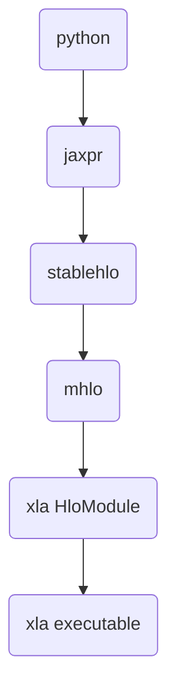

# XLA

## Architecture

For Xla Compile Op:




For Xla Run Op:



TensorFlow在XLA中JIT编译后调用编译函数并获取结果的主要步骤是:

1. XLA为计算生成HLO模块,并通过JIT将其编译为目标机器码,生成可调用的函数。
1. TensorFlow通过XLA的CompilationCache调用这个JIT编译的函数,传入Tensor参数。
1. XLA会根据Tensor的布局,插入必要的格式转换。
1. 执行JIT函数,并将结果转换为输出Tensor。
1. 如果是GPU后端,XLA会插入设备数据同步操作。
1. TensorFlow接收输出Tensor,将其从XLA格式转换到普通Tensor。
1. 如果有多个设备,XLA会为每个设备生成不同的函数。TensorFlow调度执行这些函数。
1. 对于 derivative 计算,XLA会生成微分函数,并通过同样的方式调用。编译缓存使得同样的计算图只需要编译一次。

总之,XLA为TensorFlow提供了可编译的IR。JIT编译后,TensorFlow直接调用并执行编译的函数,通过缓存提高效率。XLA处理设备管理和格式转换,兼容TensorFlow的Workflow。

## Some references

- https://zhuanlan.zhihu.com/p/98565435
- https://zhuanlan.zhihu.com/p/397328590
- https://zhuanlan.zhihu.com/p/397327235
- https://zhuanlan.zhihu.com/p/427444916

## Build openxla env (not successful)

```bash
# gcc-9, bazel
conda create -n tf2-build python=3.10 requests numpy wheel build -c conda-forge  -y
```

[build from source](https://github.com/openxla/xla/blob/main/docs/build_from_source.md)

## Build Tensorflow 2 env

```bash
conda create -n tf2-build python=3.10 requests numpy wheel build -c conda-forge  -y
yes '' | GCC_HOST_COMPILER_PATH=/usr/bin/gcc-10 CC=/usr/bin/gcc-10 TF_NEED_ROCM=0 TF_NEED_CUDA=0 TF_CUDA_CLANG=0 ./configure
bazel build //tensorflow/tools/pip_package:build_pip_package
```

[build from source](https://www.tensorflow.org/install/source?hl=zh-cn)

## Build jax env

we can install the dependencies with conda

```bash
# gcc-9, bazel
conda create -n jax-build python=3.10 numpy wheel build -c conda-forge  -y
python build/build.py --editable --configure_only --bazel_options=--config=debug_symbols
bazel run --color auto //jaxlib/tools:build_wheel -- --output_path <dir> --cpu=x86_64 --editable
```

[build from source](https://jax.readthedocs.io/en/latest/developer.html)

## Logging

- TF_CPP_MIN_LOG_LEVEL: Level to print messages for. TF_CPP_MIN_LOG_LEVEL=0 will turn on INFO logging, TF_CPP_MIN_LOG_LEVEL=1 WARNING and so on.
- TF_CPP_MAX_VLOG_LEVEL=10
- TF_CPP_VMODULE='pjit=10' will print `external/xla/xla/python/pjit.cc` vlog. I assume that `pjit` is the file name of the module.
- `TF_CPP_MAX_VLOG_LEVEL=10 TF_CPP_MIN_LOG_LEVEL=0 python test.py` will print all logs.

## Jax AutoDiff takeaways

I will take an code below as a example to explain how jax autodiff works.

```python
def f(x):
  y = sin(x) * 2.
  z = -y + x
  return z
```

Jax will compute the forward pass and backward pass at the same time.

due to the chain rules

The chain rule states that the derivative of a composite function is equal to the derivative of the outer function multiplied by the derivative of the inner function.

In mathematical notation, this can be expressed as:

If $f(x) = g(h(x))$,

then $f'(x) = g'(h(x)) * h'(x)$

Where:

$f(x)$ is the composite function

$g(x)$ is the outer function

$h(x)$ is the inner function

$f'(x)$  is the derivative of $f(x)$

$g'(x)$  is the derivative of $g(x)$

$h'(x)$  is the derivative of $h(x)$

when you exhausted the end of backward pass, you will find all the derivative formular will be like:

then

$$ \frac{df(x)}{dx} = \frac{dg(x)}{dh(x)} \times \frac{dh(x)}{dx} \times \frac{dx}{dx} = \frac{dg(x)}{dh(x)} \times \frac{dh(x)}{dx} \times 1$$

This is why the tangents (the second input) of `jax.jvp` will be `1.0`.
In another way to explain this will be:

```python
from jax import jvp

def f(x, y):
  return x + y

print(jvp(f, (1., 2.), (1., 0.))) # this is the derivative wrt x.
print(jvp(f, (1., 2.), (0., 1.))) # this is the derivative wrt y.
```

The example above show the partial derivative of $f(x, y)$ wrt $x$ and $y$.

also you can use `jax.grad` to compute the partial derivative of $f(x, y)$ wrt $x$ and $y$.

```python
from jax import grad

def f(x, y):
  return x + y

print(grad(f, argnums=0)(1., 2.)) # this is the derivative wrt x.
print(grad(f, argnums=1)(1., 2.)) # this is the derivative wrt y.
```

In light of this, we can calculate the forward pass and backward pass at the same time.

The idea of this is like:

```python
from jax import grad
def f(x):
  y = sin(x) * 2.
  z = -y + x
  return z

print(grad(f)(3.0))

```

1. compute sin(x) with forward rule and compute the backward value with backward rule of sin(x). Inputs of backward are `primals = (3.0, )` and `tangents = (1.0, )`.

2. compute `0.1411200080598672 (the output from stage 1) * 2.` with forward rule and compute the backward value with multiply backward rule of `sin(x) * 2.`. Inputs of backward are `primals = (0.1411200080598672 [sin(3)], 2.0)` and `tangents = (-0.9899924966004454 [1.0 * cos(3.0)], 0)`.

3. compute `neg` (`-y` in the code) operator with stage 2 output and compute
the backward value with `neg` backward rule. Inputs of backward are `primals = (0.2822400161197344, )` and `tangents = (-1.9799849932008908, )`.

3. compute `add` (`z` in the code) operator with stage 3 output and compute
the backward value with `add` backward rule. Inputs of backward are `primals = (-0.2822400161197344, 3.0)` and `tangents = (1.9799849932008908, 1.0)`.

4. obtain the output `(2.7177599838802657 [forward], 2.979984993200891 [backward])`

the code example from the Jax document is in the `jax-core/jax_core.py` you can debug for free.

## Jax (not with jit) for xla lowering call stack

```log
python: ploy
python: reraise_with_filtered_traceback{fun(*args, **kwargs)}
c++: PjitFunction::Call
python: cache_miss
python: _python_pjit_helper
python: pjit_p.bind
python: bind_with_trace
{ ### EvalTracer
  python: full_raise
  python: self.pure
}
python: EvalTracer.process_primitive # this is the calculation implementation of primitive.
python: _pjit_call_impl
python: xc._xla.pjit # this is the xla lowering cal stack.
c++: PjitFunction::Call
python: call_impl_cache_miss
python: _pjit_call_impl_python # the jaxpr is lowering to xla and compiled to xla executable.

{ #### this is the xla lowering call stack.
  python: _pjit_lower
  python: _pjit_lower_cached
  python: pxla.lower_sharding_computation {func(*args, **kwargs)}
  python: lower_sharding_computation
  python: _cached_lowering_to_hlo
  python: mlir.lower_jaxpr_to_module
  python: mlir.lower_jaxpr_to_fun
  python: jaxpr_subcomp # Lowers a jaxpr into MLIR, inlined into an existing function.
  python: _nary_lower_hlo # Lowers an elementwise operator to its MLIR equivalent.
} -> jaxpr to stablehlo

{  #### compile lowering stablehlo to xla executable (xla hloModule).
  python: compile
  python: UnloadedMeshExecutable.from_hlo
  python: _cached_compilation {xla_bridge}
  python: dispatch.compile_or_get_cached
  python: compile_or_get_cached
  python: backend_compile
  python: backend.compile # (self: jaxlib.xla_extension.Client, computation: str, compile_options: jaxlib.xla_extension.CompileOptions = <jaxlib.xla_extension.CompileOptions object at 0x7f8b68829570>, host_callbacks: List[capsule] = []) -> xla::PyLoadedExecutable
  c++: PyClient::Compile (external/xla/xla/python/xla.cc)
}

{ #### xla executable run
  python: executable.unsafe_call
  python: self.xla_executable.execute_sharded(input_bufs)
  c++: PyLoadedExecutable::ExecuteSharded (external/xla/xla/python/xla.cc)
  python: results.consume_with_handlers(self.out_handler.handlers)
  c++: PyExecuteResults::ConsumeWithHandlers(std::move(out_handlers)) (external/xla/xla/python/xla.cc)
  # note return fastdatapath in order to call fast (this is cache)
}

```

in the function [`lower_sharding_computation`](jax/_src/interpreters/pxla.py#L1965-L1966)

1. Lowers a computation to XLA. It can take arbitrary shardings as input
-> `jaxlib.xla_extension.Client` and get device assignment.
2. Build stableHLO (lowering Jaxpr to MLIR)
3. Compile stableHLO to XLA executable (xla hloModule)
4. Run the XLA executable

This is a good prototype for jax core implementation from jax website.
- [autodidax](https://jax.readthedocs.io/en/latest/autodidax.html)


## Jax (with jit) for xla lowering call stack

```log
python: ploy
python: reraise_with_filtered_traceback{fun(*args, **kwargs)}
c++: PjitFunction::Call
python: cache_miss
python: _python_pjit_helper
{
  python: infer_params
  # `infer_params` func. It is different with not jit.
  # This will change the input into placeholder.
  # this func will registed during the `jit` decorator.
  # and set the `inline = True` for jit mode.
  # Note: for non-jit mode, the `inline = False`.
}
python: pjit_p.bind
python: bind_with_trace
python: DynamicJaxprTrace.process_primitive # this is the calculation implementation of primitive.
{
  python: pjit_staging_rule
} after this the `process_primitive` will return a placeholder instead of a value.

```

`_read_most_recent_pjit_call_executable` function will return a cached function for a single operation without jit mode.

### DFS for the pjit travel

```python
def toy(x):  # Define a function
  y = jnp.exp(-2.0 * x)
  return y ** 2

jit_toy = jit(toy)  # Compile the function
```

```log

python: jit
python: pjit_info
python: infer_params
python: _create_pjit_expr
python: trace_to_jaxpr_dynamic
python: trace_to_subjaxpr_dynamic
python: fun.call_wrapped
python: self.f # toy function in code.
  python: the "*" operator in `-2.0 * x`
  python: infer_params # here is the recursive but the operator is mul not pjit.
    ...
  python: self.f # here is the jax multiply
    ...
  # recursive until to the last operator. It is like the DFS travel expression tree.
  # after recursive, the jaxpr will be created.
```

## Jax lowering pass



## Jax calling the cached xla funcion with `xla_extension.PjitFuncion`

Jax will regested the python callable object through the `jax::BuildPjitSubmodule(m)`
which is in the `xla_extension.so` file. you can specify the `PYTHONPATH` to the parent directory of the `xla_extension.so` file.
After that, you can import xla_extension module in python console.

The `xla_extension.PjitFunction` is a python callable object implemented by C++ function. This is decribed in the `xla/xla/python/pjit.cc` file.

The cached pjit function will be compiled during the first call and the decorated function will be converted into pybind cpp function.
by doing this, the input will directly pass to the function that is allocated with python heap by pybind framework.

```c++
    PyTypeObject* type = &heap_type->ht_type;
    type->tp_name = "PjitFunction";
    ...
    type->tp_new = PjitFunction_tp_new;
    type->tp_dealloc = PjitFunction_tp_dealloc;
    type->tp_dictoffset = offsetof(PjitFunctionObject, dict);
    type->tp_traverse = PjitFunction_tp_traverse;
    type->tp_clear = PjitFunction_tp_clear;
    type->tp_weaklistoffset = offsetof(PjitFunctionObject, weakrefs);
    type->tp_getset = PjitFunction_tp_getset;
    type->tp_descr_get = PjitFunction_tp_descr_get;
    type->tp_call = PyVectorcall_Call;
    type->tp_vectorcall_offset = offsetof(PjitFunctionObject, vectorcall);
    type->tp_repr = PjitFunction_tp_repr;
```


```c++
PyObject* PjitFunction_tp_new(PyTypeObject* subtype, PyObject* args,
                              PyObject* kwds) {
  PjitFunctionObject* self =
      reinterpret_cast<PjitFunctionObject*>(subtype->tp_alloc(subtype, 0));
  if (!self) return nullptr;
  self->dict = nullptr;
  self->weakrefs = nullptr;
  self->vectorcall = PjitFunction_tp_vectorcall;
  return reinterpret_cast<PyObject*>(self);
}
```
The `tp_new` function will be called when the `PjitFunction` object is created.
The `PjitFunction_tp_vectorcall` function will be set to the `self->vectorcall` offset.
This is the reason why `type->tp_vectorcall_offset = offsetof(PjitFunctionObject, vectorcall)`.
This will redirect to the `PjitFunction_tp_vectorcall`

```cpp
PyObject* PjitFunction_tp_vectorcall(PyObject* callable, PyObject* const* args,
                                     size_t nargs, PyObject* kwnames) {
  PjitFunctionObject* o = reinterpret_cast<PjitFunctionObject*>(callable);
  tsl::profiler::TraceMe traceme([&] {
    return absl::StrCat("PjitFunction(", o->fun.function_name(), ")");
  });
  try {
    xla::StatusOr<py::object> out = o->fun.Call(callable, args, nargs, kwnames); // this is the cached function.
    if (!out.ok()) {
      PyErr_SetString(PyExc_ValueError, out.status().ToString().c_str());
      return nullptr;
    }
    return out.value().release().ptr();
  } catch (py::error_already_set& e) {
    e.restore();
    return nullptr;
  } catch (py::cast_error& e) {
    PyErr_SetString(PyExc_ValueError, e.what());
    return nullptr;
  } catch (std::invalid_argument& e) {
    PyErr_SetString(PyExc_ValueError, e.what());
    return nullptr;
  } catch (std::runtime_error& e) {
    PyErr_SetString(PyExc_ValueError, e.what());
    return nullptr;
  }
}
```

<!--- TODO:
1. look into the Cpp part for xla compile and xla run.
------>
