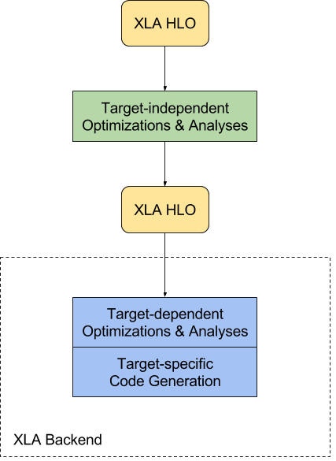

# XLA

## Architecture

For Xla Compile Op:




For Xla Run Op:


TensorFlow在XLA中JIT编译后调用编译函数并获取结果的主要步骤是:

1. XLA为计算生成HLO模块,并通过JIT将其编译为目标机器码,生成可调用的函数。
1. TensorFlow通过XLA的CompilationCache调用这个JIT编译的函数,传入Tensor参数。
1. XLA会根据Tensor的布局,插入必要的格式转换。
1. 执行JIT函数,并将结果转换为输出Tensor。
1. 如果是GPU后端,XLA会插入设备数据同步操作。
1. TensorFlow接收输出Tensor,将其从XLA格式转换到普通Tensor。
1. 如果有多个设备,XLA会为每个设备生成不同的函数。TensorFlow调度执行这些函数。
1. 对于 derivative 计算,XLA会生成微分函数,并通过同样的方式调用。编译缓存使得同样的计算图只需要编译一次。

总之,XLA为TensorFlow提供了可编译的IR。JIT编译后,TensorFlow直接调用并执行编译的函数,通过缓存提高效率。XLA处理设备管理和格式转换,兼容TensorFlow的Workflow。

## Some references

- https://zhuanlan.zhihu.com/p/98565435
- https://zhuanlan.zhihu.com/p/397328590
- https://zhuanlan.zhihu.com/p/397327235
- https://zhuanlan.zhihu.com/p/427444916

## build openxla env

```bash
# gcc-9, bazel
conda create -n xla-build python=3.9 numpy -y
```

[build from source](https://github.com/openxla/xla/blob/main/docs/build_from_source.md)

## build jax env

we can install the dependencies with conda

```bash
# gcc-9, bazel
conda create -n jax-build python=3.10 numpy wheel build -c conda-forge  -y
```
